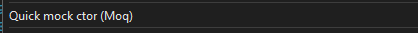

[](https://github.com/rpbeukes/Moq.QuickMock/actions/workflows/CI_main.yml?query=branch%3Amain+) [](https://github.com/rpbeukes/Moq.QuickMock/blob/main/LICENSE)

# Moq.QuickMock
Small Visual Studio 2022 extension to help with [Moq](https://github.com/moq/moq) tests.

---

## Scenario

Extension will change code from this:

**MyTests.cs**:
```
[TestClass()]
public class TheTestFunction()
{
    var r = new CodeWithBigConstructor();
}
```

to this:

**MyTests.cs**:
```
[TestClass()]
public class TheTestFunction()
{
    var r = new CodeWithBigConstructor(Mock.Of<ILogger<CodeWithBigConstructor>>(), Mock.Of<ISecureUser>(), Mock.Of<Func<SomeCoolFunction>>());
}
```
---

**NOTE:** This extension will only change code following the file naming convention `*tests.cs` eg: `TheseAreMyHeroTests.cs`.

---

## Download Moq.QuickMock.vsix and install
Download `Moq.QuickMock.vsix` from latest successful [build](https://github.com/rpbeukes/Moq.QuickMock/actions/workflows/CI_main.yml?query=branch%3Amain+is%3Asuccess).

---

## How to use
Put the `cursor (caret)` between the `()`, and hit `CTRL + .`.

```
var r = new CodeWithBigConstructor(<cursor>);
```

Find `Quick mock ctor (Moq)` Refactor Menu Options:



---

## Know issues
- Extension generates `Fully qualified type` names.
  eg:
```
   var c = new CodeWithBigConstructor(Mock.Of<App.That.Will.Take.Over.The.World.ISecureUser>());
```
The dream:
```
   var c = new CodeWithBigConstructor(Mock.Of<ISecureUser>());
```
---

## ToDos

### Tasks (Priority ordered)
- Remove fully qualified types.
- add test project.
- create better visual explanation (.gif) of the extension's intent.
- auto increment extension version on a successful build.
- add an icon.
- deploy to [Visual Studio Marketplace](https://marketplace.visualstudio.com/), so one gets updates automagically.

### Investigations
- Unit testing extensions (or something like that).